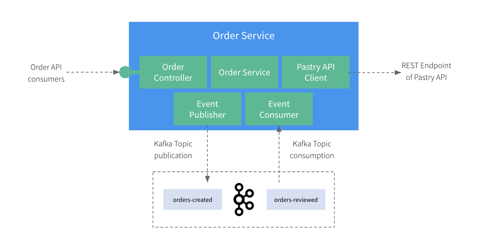

# Step 2: Exploring the App

This fictional application we're working on is a typical `Order Service` that can allow online, physical stores, or even partners to place orders for our fresh-baked pastries! For that, the `Order Service` is exposing a REST API to its consumers but also relies on an existing API we have [introduced in a previous post](https://medium.com/@lbroudoux/different-levels-of-api-contract-testing-with-microcks-ccc0847f8c97) 😉

The `Order Service` application has been designed around 5 main components that are directly mapped on ASP.NET Core classes:
* The [OrderController.cs](src/order.service/API/OrderController.cs) is responsible for exposing an Order API to the outer world.
* The [OrderService.cs](src/order.service/Application/OrderService.cs) is responsible for implementing the business logic around the creation of orders.
* The [PastryApiClient.cs](src/order.service/Infrastructure/PastryApiClient.cs) is responsible for calling the Pastry API in Product Domain and get details or list of pastries.
* The [OrderEventPublisher.cs](src/order.service/Infrastructure/OrderEventPublisher.cs) is responsible for publishing a message on a Kafka topic when a new Order is created.
* The [OrderEventListener.cs](src/order.service/Infrastructure/OrderEventListener.cs) is responsible for consuming messages on a Kafka topic when an Order has been reviewed.

Of course, this is a very naive vision of a real-life system as such an application would certainly pull out much more dependencies (like a Payment Service, a Customer Service, a Shipping Service, and much more) and offer more complex API.

However, this situation is complex enough to highlight the two problems we're addressing:

1. How to **efficiently set up a development environment** that depends on third-party API like the Pastry API?
   - You certainly want to avoid cloning this component repository and trying to figure out how to launch and configure it accordingly.
   - As a developer, developing your own mock of this service makes you also lose time and risk drifting from initial intent.
2. How to **efficiently validate the conformance** of the Order API and Order Events against business expectations and API contracts?
   - Besides the core business logic, you might want to validate the network and protocol serialization layers as well as the respect of semantics.

## Business logic

This application must implement basic flows:

* When creating a new [Order](src/order.service/Domain/Order.cs), the service must check that the products are available before creating and persisting an order. Otherwise, order cannot be placed.
* When the [Order](src/order.service/Domain/Order.cs) is actually created, the service must also publish an [OrderEvent](src/order.service/Domain/OrderEvent.cs) to a specific Kafka topic to propagate this information to other systems that will review the events.
* When the [OrderEvent](src/order.service/Domain/OrderEvent.cs) has been reviewed, a new message is published on another Kafka topic. The [OrderEventListener](src/order.service/Infrastructure/OrderEventListener.cs) must capture it and update the corresponding [Order](src/order.service/Domain/Order.cs) status using the service.

## Flows specifications

All the interactions are specified using API contracts:

* The Order API is specified using the [order-service-openapi.yaml](tests/order.service.tests/resources/order-service-openapi.yaml) OpenAPI specification,
* The Pastry API is specified using the [apipastries-openapi.yaml](tests/order.service.tests/resources/apipastries-openapi.yaml) OpenAPI specification,
* The Order Events are specified using the [order-events-asyncapi.yaml](tests/order.service.tests/resources/order-events-asyncapi.yaml) AsyncAPI specification.

Those specifications will help us for two things:

1. They will be used to provide simulations (or mocks) of third-parties systems - typically the Pastry API provider and the reviewer system that provides updates on OrderEvents
2. They will be used to allow checking the conformance of the provided Order API and the published Order Event on order creation.

[Next](step3-local-development.md)
