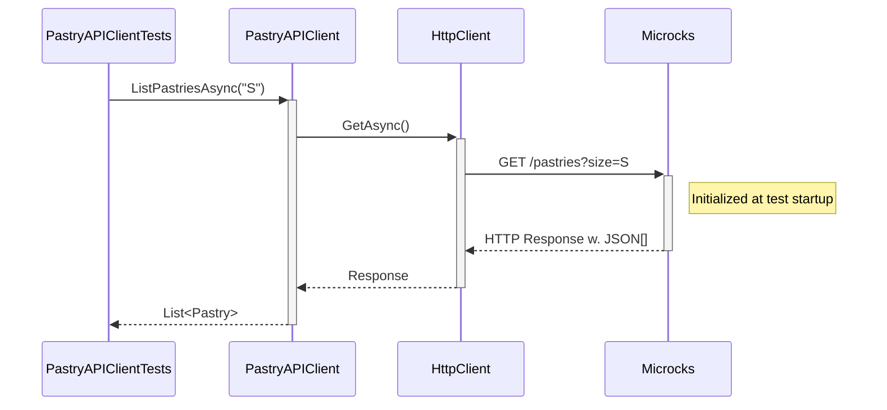
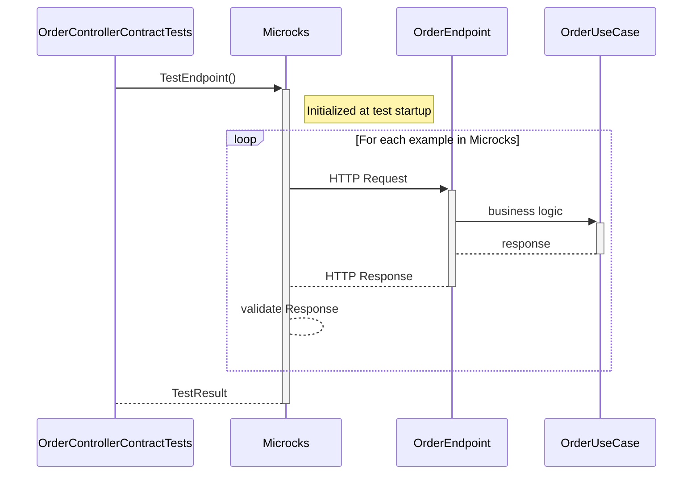

# Step 4: Let's write tests for the REST APIs

So far, we focused on being able to run the application locally without having to install or run any dependent services manually.
But there is nothing more painful than working on a codebase without a comprehensive test suite.

Let's fix that!!

## Common Test SetUp

For all the integration tests in our application, we need to start Kafka and use mocks provided by Microcks containers.

### Review MicrocksWebApplicationFactory<Program> class under tests/Order.Service.Tests

In .NET, we use a custom `WebApplicationFactory<Program>` to provision all required containers and inject configuration for local development and testing. This leverages the .NET Testcontainers library and ASP.NET Core's test infrastructure.

Here's how it works:

* The factory provisions a Kafka container and a Microcks container ensemble automatically, using a shared Docker network for service discovery.
* It imports all required contract and collection artifacts into Microcks at startup.
* The factory exposes host ports and injects the correct mock endpoints (e.g., Pastry API) into the application configuration, so your HTTP clients use the simulated endpoints provided by Microcks.
* The test base class (`BaseIntegrationTest`) ensures all tests have access to the factory, port, and container ensemble.

Example:
```csharp
public class MicrocksWebApplicationFactory<TProgram> : KestrelWebApplicationFactory<TProgram>, IAsyncLifetime
    where TProgram : class
{
    // ...existing code...
    public async ValueTask InitializeAsync()
    {
        // Allocate a free port and expose it for container communication
        ActualPort = GetAvailablePort();
        UseKestrel(ActualPort); // ⬅️ Here we configure Kestrel to use the allocated port

        // ⬇️ Here we expose the port for host communication, before starting the containers
        await TestcontainersSettings.ExposeHostPortsAsync(ActualPort, TestContext.Current.CancellationToken)
            .ConfigureAwait(true);

        var network = new NetworkBuilder().Build();
        KafkaContainer = new KafkaBuilder()
            .WithImage("confluentinc/cp-kafka:7.9.0")
            .WithNetwork(network)
            .WithNetworkAliases("kafka")
            .WithListener("kafka:19092")
            .Build();
        await this.KafkaContainer.StartAsync(TestContext.Current.CancellationToken)
            .ConfigureAwait(true);

        this.MicrocksContainerEnsemble = new MicrocksContainerEnsemble(network, MicrocksImage)
            .WithAsyncFeature()
            .WithMainArtifacts("resources/order-service-openapi.yaml", "resources/order-events-asyncapi.yaml", "resources/third-parties/apipastries-openapi.yaml")
            .WithSecondaryArtifacts("resources/order-service-postman-collection.json", "resources/third-parties/apipastries-postman-collection.json")
            .WithKafkaConnection(new KafkaConnection($"kafka:19092"));
        await this.MicrocksContainerEnsemble.StartAsync()
            .ConfigureAwait(true);
    }

    protected override void ConfigureWebHost(IWebHostBuilder builder)
    {
        base.ConfigureWebHost(builder);

        var microcksContainer = this.MicrocksContainerEnsemble.MicrocksContainer;
        var pastryApiEndpoint = microcksContainer.GetRestMockEndpoint("API Pastries", "0.0.1");

        // Configure the factory to use the Microcks container address
        // Use Uri constructor to ensure proper path handling
        builder.UseSetting("PastryApi:BaseUrl", $"{pastryApiEndpoint}/");
    }
    // ...existing code...
}
```

This setup means you do not need to manually start Kafka, Microcks, or any other dependencies. The test factory provisions everything automatically, injects the correct endpoints, and ensures your application uses the simulated services for local development and contract testing.

Let's understand what this configuration class does:

* `MicrocksWebApplicationFactory` extends `KestrelWebApplicationFactory<TProgram>` to provide a custom test environment for our application. `KestrelWebApplicationFactory` is a solution to expose the application on the real host port. In the .NET 10 (under development), this class can be replaced by the `WebApplicationFactory<TProgram>` class.
* `InitializeAsync` method is called to set up the test environment before running tests. It allocates a free port, starts the Kafka container, and initializes the Microcks container ensemble with the required artifacts.
In detail:
   * We allocate a free port and expose it for container communication, in .NET it's possible to assign a dynamic port to the kestrel server but when we use Microcks Contract Testing, it's necessary to call the `ExposeHostPortsAsync` method to expose the port for host communication.
   This method ensures that the port is available for communication between the host and the containers, and it is important to call it before starting the containers (This adds extra-host property to the Microcks container).
   It's not possible to inject the connection string and other configuration in the WebApplicationFactory, so we determine the port before starting the WebApplicationFactory.
   * We configure the Kafka container using the `KafkaBuilder` to set the image, network, and other properties.
   * We also configure a `MicrocksContainersEnsemble` that will be responsible for providing mocks for our 3rd party systems.
   * `ConfigureWebHost` method is overridden to set the base URL for the Pastry API using the endpoint provided by Microcks. This ensures that the application uses the simulated Pastry API endpoint during tests.
   We also configure the kafka connection string to point to the Kafka container.

And that's it! 🎉 You don't need to download and install extra-things, or clone other repositories and figure out how to start your dependant services. 

### Review BaseIntegrationTest class under `tests/Order.Service.Tests`

Next, let's create a `BaseIntegrationTest` class under `tests/Order.Service.Tests` to encapsulate the common setup and configuration our integration tests.

The `BaseIntegrationTest` implements `IClassFixture<WebApplicationFactory<Program>>` to use the custom `WebApplicationFactory` we just created. This allows us to share the same configuration accross all integration tests.


```csharp
using System.Net.Http;
using Microsoft.AspNetCore.Mvc.Testing;
using Xunit;

namespace Order.Service.Tests
{
    public class BaseIntegrationTest : IClassFixture<WebApplicationFactory<Program>>
    {
        protected readonly HttpClient _client;

        public BaseIntegrationTest(WebApplicationFactory<Program> factory)
        {
            _client = factory.CreateClient();
        }
    }
}
```

## First Test - Verify our RESTClient

In this section, we'll focus on testing the `Pastry API Client` component of our application:


Let's review the test class `PastryAPIClientTests` under `tests/Order.Service.Tests/Clients`.

```csharp
public class PastryAPIClientTests : BaseIntegrationTest
{
    private readonly ITestOutputHelper TestOutputHelper;

    public PastryAPIClientTests(
        ITestOutputHelper testOutputHelper,
        MicrocksWebApplicationFactory<Program> factory)
        : base(factory)
    {
        TestOutputHelper = testOutputHelper;
    }

    [Fact]
    public async Task TestPastryAPIClient_ListPastriesAsync()
    {
        // Arrange
        var pastryAPIClient = this.Factory.Services.GetRequiredService<PastryAPIClient>(); // Ensure the client is registered
        List<Pastry> pastries = await pastryAPIClient.ListPastriesAsync("S", TestContext.Current.CancellationToken);
        Assert.Single(pastries); // Assuming there is 1 pastry in the mock data

        pastries = await pastryAPIClient.ListPastriesAsync("M", TestContext.Current.CancellationToken);
        Assert.Equal(2, pastries.Count); // Assuming there are 2 pastries in the mock

        pastries = await pastryAPIClient.ListPastriesAsync("L", TestContext.Current.CancellationToken);
        Assert.Equal(2, pastries.Count); // Assuming there is 1 pastry in the mock
    }

    [Fact]
    public async Task TestPastryAPIClient_GetPastryByNameAsync()
    {
        // Arrange
        var pastryAPIClient = this.Factory.Services.GetRequiredService<PastryAPIClient>();

        // Act & Assert : Millefeuille (disponible)
        var millefeuille = await pastryAPIClient.GetPastryByNameAsync("Millefeuille", TestContext.Current.CancellationToken);
        Assert.NotNull(millefeuille);
        Assert.Equal("Millefeuille", millefeuille.Name);
        Assert.True(millefeuille.IsAvailable());

        // Act & Assert : Éclair au café (disponible)
        var eclairCafe = await pastryAPIClient.GetPastryByNameAsync("Eclair Cafe", TestContext.Current.CancellationToken);
        Assert.NotNull(eclairCafe);
        Assert.Equal("Eclair Cafe", eclairCafe.Name);
        Assert.True(eclairCafe.IsAvailable());

        // Act & Assert : Éclair chocolat (indisponible)
        var eclairChocolat = await pastryAPIClient.GetPastryByNameAsync("Eclair Chocolat", TestContext.Current.CancellationToken);
        Assert.NotNull(eclairChocolat);
        Assert.Equal("Eclair Chocolat", eclairChocolat.Name);
        Assert.False(eclairChocolat.IsAvailable());
    }
}

```

If you run this test, it should pass and that means we have successfully configured the application to start with all the required containers
and that they're correctly wired to the application. Within this test:
* We're reusing the data that comes from the examples in the `Pastry API` OpenAPI specification and Postman collection.
* The `PastryAPIClient` has been configured with a REST Client that is wired to the Microcks mock endpoints.
* We're validating the configuration of this client as well as all the JSON and network serialization details of our configuration!  

The sequence diagram below details the test sequence. Microcks is used as a third-party backend to allow going through all the layers:



### 🎁 Bonus step - Check the mock endpoints are actually used

While the above test is a good start, it doesn't actually check that the mock endpoints are being used. In a more complex application, it's possible
that the client is not correctly configured or use some cache or other mechanism that would bypass the mock endpoints. In order to check that you
can actually use the `VerifyAsync()` method available on the Microcks container:

```csharp
[Fact]
public async Task TestPastryAPIClient_ListPastriesAsync()
{
    // Arrange
    var pastryAPIClient = this.Factory.Services.GetRequiredService<PastryAPIClient>(); // Ensure the client is registered
    List<Pastry> pastries = await pastryAPIClient.ListPastriesAsync("S", TestContext.Current.CancellationToken);
    Assert.Single(pastries); // Assuming there is 1 pastry in the mock data

    pastries = await pastryAPIClient.ListPastriesAsync("M", TestContext.Current.CancellationToken);
    Assert.Equal(2, pastries.Count); // Assuming there are 2 pastries in the mock

    pastries = await pastryAPIClient.ListPastriesAsync("L", TestContext.Current.CancellationToken);
    Assert.Equal(2, pastries.Count); // Assuming there is 1 pastry in the mock

    bool isVerified = await MicrocksContainer.VerifyAsync("API Pastries", "0.0.1");
    Assert.True(isVerified, "Pastry API should be verified successfully");
}
```

If you need finer-grained control, you can also check the number of invocations with `GetServiceInvocationsCountAsync()`. This way you can check that
the mock has been invoked the correct number of times:

```csharp
[Fact]
public async Task TestPastryAPIClient_GetPastryByNameAsync()
{
    // Arrange
    double initialInvocationCount = await MicrocksContainer.GetServiceInvocationsCountAsync("API Pastries", "0.0.1");

    var pastryAPIClient = this.Factory.Services.GetRequiredService<PastryAPIClient>();

    // Act & Assert : Millefeuille (disponible)
    var millefeuille = await pastryAPIClient.GetPastryByNameAsync("Millefeuille", TestContext.Current.CancellationToken);
    Assert.NotNull(millefeuille);
    Assert.Equal("Millefeuille", millefeuille.Name);
    Assert.True(millefeuille.IsAvailable());

    // Act & Assert : Éclair au café (disponible)
    var eclairCafe = await pastryAPIClient.GetPastryByNameAsync("Eclair Cafe", TestContext.Current.CancellationToken);
    Assert.NotNull(eclairCafe);
    Assert.Equal("Eclair Cafe", eclairCafe.Name);
    Assert.True(eclairCafe.IsAvailable());

    // Act & Assert : Éclair chocolat (indisponible)
    var eclairChocolat = await pastryAPIClient.GetPastryByNameAsync("Eclair Chocolat", TestContext.Current.CancellationToken);
    Assert.NotNull(eclairChocolat);
    Assert.Equal("Eclair Chocolat", eclairChocolat.Name);
    Assert.False(eclairChocolat.IsAvailable());

    // Vérifier le nombre d'invocations
    double finalInvocationCount = await MicrocksContainer.GetServiceInvocationsCountAsync("API Pastries", "0.0.1");
    Assert.Equal(initialInvocationCount + 3, finalInvocationCount);
}
```

This is a super powerful way to ensure that your application logic (caching, no caching, etc.) is correctly implemented and use the
mock endpoints when required 🎉

## Second Test - Verify the technical conformance of Order Service API

The 2nd thing we want to validate is the conformance of the `Order API` we'll expose to consumers. In this section and the next one,
we'll focus on testing the `OrderController` component of our application:


## Bonus - Test the exposed HTTP API directly

You can also write an integration test that uses `HttpClient` to invoke the exposed HTTP layer and validate each response with .NET assertions:

```csharp
[Fact]
public async Task Should_Return_Order_When_Get_By_Id()
{
    // Arrange
    var orderId = 5;
    var response = await _client.GetAsync($"/api/orders/{orderId}");

    // Assert
    response.EnsureSuccessStatusCode();
    var json = await response.Content.ReadAsStringAsync();
    using var doc = System.Text.Json.JsonDocument.Parse(json);
    var root = doc.RootElement;

    // Vérification explicite de la structure JSON
    Assert.True(root.TryGetProperty("orderId", out var orderIdProp), "orderId property should exist");
    Assert.Equal(orderId, orderIdProp.GetInt32());

    Assert.True(root.TryGetProperty("status", out var statusProp), "status property should exist");
    Assert.Equal("Created", statusProp.GetString());

    // Vérifier d'autres propriétés attendues si besoin
}
```

This certainly works but presents 2 problems in my humble opinion:
* It's a lot of code to write! And it's apply to each API interaction because for each interaction it's probably a good idea to
  check the structure of same objects in the message. This lead to a fair amount of code!
* The code you write here is actually a language specific translation of the OpenAPI specification for the `Order API`: so the same
  "rules" get duplicated. Whether you edit the code or the OpenAPI spec first, high are the chances you get some drifts between your test
  suite and the specification you will provide to consumers!

Microcks Testcontainer integration provides another approach by letting you reuse the OpenAPI specification directly in your test suite,
without having to write assertions and validation of messages for API interaction.

Let's review the test class `OrderControllerContractTests` under `tests/Order.Service.Tests/Api`:

```csharp
[Fact]
public async Task TestOpenApiContract()
{
    TestRequest request = new()
    {
        ServiceId = "Order Service API:0.1.0",
        RunnerType = TestRunnerType.OPEN_API_SCHEMA,
        TestEndpoint = "http://host.testcontainers.internal:" + Port + "/api"
    };

    var testResult = await MicrocksContainer.TestEndpointAsync(request);

    Assert.True(testResult.Success, "Test should be successful");

    Assert.Single(testResult.TestCaseResults);
}
```

Here, we're using a Microcks-provided `TestRequest` object that allows us to specify to Microcks the scope of the conformance
test we want to run:
* We ask for testing our endpoint against the service interface of `Order Service API` in version `0.1.0`.
  These are the identifiers found in the `order-service-openapi.yaml` file.
* We ask Microcks to validate the `OpenAPI Schema` conformance by specifying a `runnerType`.
* We ask Microcks to validate the localhost endpoint on the dynamic port provided by the Spring Test (we use the `host.testcontainers.internal` alias for that).

Finally, we're retrieving a `TestResult` from Microcks containers, and we can assert stuffs on this result, checking it's a success.

The sequence diagram below details the test sequence. Microcks is used as a middleman that actually invokes your API with the example from its dataset: 



Our `OrderEndpoint` (or `OrderController` if you use MVC) development is technically correct: all the JSON and HTTP serialization layers have been tested!


## Third Test - Verify the business conformance of Order Service API

> [!NOTE]
> This feature around POSTMAN is not available in the .NET Testcontainers library yet, but it is planned for a future release.

The above section allows us to validate the technical conformance but not the business one! Imagine we forgot to record all the
requested products in the order or change the total price in resulting order. This could raise some issues!

Microcks allows to execute business conformance test by leveraging Postman Collection. If you're familiar with Postman Collection
scripts, you'll open the `order-service-postman-collection.json` file and find some snippets like:

```jshelllanguage
pm.test("Correct products and quantities in order", function () {
    var order = pm.response.json();
    var productQuantities = order.productQuantities;
    pm.expect(productQuantities).to.be.an("array");
    pm.expect(productQuantities.length).to.eql(requestProductQuantities.length);
    for (let i=0; i<requestProductQuantities.length; i++) {
        var productQuantity = productQuantities[i];
        var requestProductQuantity = requestProductQuantities[i];
        pm.expect(productQuantity.productName).to.eql(requestProductQuantity.productName);
    }
});
```

This snippet typically describes business constraints telling that a valid order response should have unchanged product and quantities.  

You can now validate this from your Java Unit Test as well! Let's review the test class `OrderControllerPostmanContractTests` 
under `tests/Order.Service.Tests/Api`:

```csharp
public class OrderControllerPostmanContractTests : BaseIntegrationTest
{
    [Fact]
    public void TestPostmanCollectionContract()
    {
        // Ask for a Postman Collection script conformance to be launched.
        TestRequest request = new()
        {
            ServiceId = "Order Service API:0.1.0",
            RunnerType = TestRunnerType.POSTMAN,
            TestEndpoint = "http://host.testcontainers.internal:" + Port + "/api"
        };

        var testResult = await MicrocksContainer.TestEndpointAsync(request);

        Assert.True(testResult.Success, "Test should be successful");

        Assert.Single(testResult.TestCaseResults);
    }
}
```

Comparing to the code in previous section, the only change here is that we asked Microcks to use a `Postman` runner
for executing our conformance test. What happens under the hood is now that Microcks is re-using the collection snippets
to put some constraints on API response and check their conformance.

The test sequence is exactly the same as in the previous section. The difference here lies in the type of response validation: Microcks
reuses Postman collection constraints.

You're now sure that beyond the technical conformance, the `Order Service` also behaves as expected regarding business 
constraints. 

### 🎁 Bonus step - Verify the business conformance of Order Service API in pure .NET

Even if the Postman Collection runner is a great way to validate business conformance, you may want to do it in pure .NET.
This is possible by retrieving the messages exchanged during the test and checking their content. Let's review the `TestOpenAPIContractAndBusinessConformance()`
test in class `OrderControllerContractTests` under `tests/Order.Service.Tests/Api`:

```csharp
[Fact]
public async Task TestOpenAPIContractAndBusinessConformance()
{
    TestRequest request = new()
    {
        ServiceId = "Order Service API:0.1.0",
        RunnerType = TestRunnerType.OPEN_API_SCHEMA,
        TestEndpoint = "http://host.testcontainers.internal:" + Port + "/api",
    };

    var testResult = await this.MicrocksContainer.TestEndpointAsync(request);

    // You may inspect complete response object with following:
    var json = JsonSerializer.Serialize(testResult, new JsonSerializerOptions { WriteIndented = true });
    TestOutputHelper.WriteLine(json);

    Assert.False(testResult.InProgress, "Test should not be in progress");
    Assert.True(testResult.Success, "Test should be successful");

    Assert.Single(testResult.TestCaseResults);

    var messages = await MicrocksContainer.GetMessagesForTestCaseAsync(testResult, "POST /orders");
    foreach (var message in messages)
    {
        if ("201".Equals(message.Response.Status))
        {
            // Parse the request and response content as JsonDocument
            var responseDocument = JsonDocument.Parse(message.Response.Content);
            var requestDocument = JsonDocument.Parse(message.Request.Content);

            // Directly access the 'productQuantities' array in both request and response
            var requestProductQuantities = requestDocument.RootElement.GetProperty("productQuantities");
            var responseProductQuantities = responseDocument.RootElement.GetProperty("productQuantities");

            // Compare the number of items in both arrays
            Assert.Equal(requestProductQuantities.GetArrayLength(), responseProductQuantities.GetArrayLength());
            for (int i = 0; i < requestProductQuantities.GetArrayLength(); i++)
            {
                // Compare the 'productName' property for each item
                var reqProductName = requestProductQuantities[i].GetProperty("productName").GetString();
                var respProductName = responseProductQuantities[i].GetProperty("productName").GetString();
                Assert.Equal(reqProductName, respProductName);
            }
        }
    }
}
```

This test is a bit more complex than the previous ones, **but for the moment it is the only available option in .NET**. It first asks for an OpenAPI conformance test to be launched and then retrieves the messages
to check business conformance, following the same logic that was implemented into the Postman Collection snippet.

It uses the `GetMessagesForTestCaseAsync()` method to retrieve the messages exchanged during the test and then checks the content. While this is done
in pure .NET here, you may use the tool or library of your choice like [Shouldly](https://docs.shouldly.org), [Reqnroll](https://reqnroll.net) or others.


### 
[Next](step-5-write-async-tests.md)