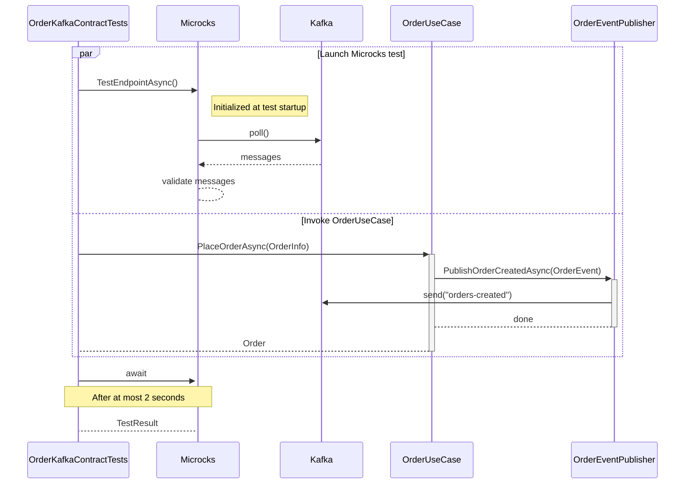
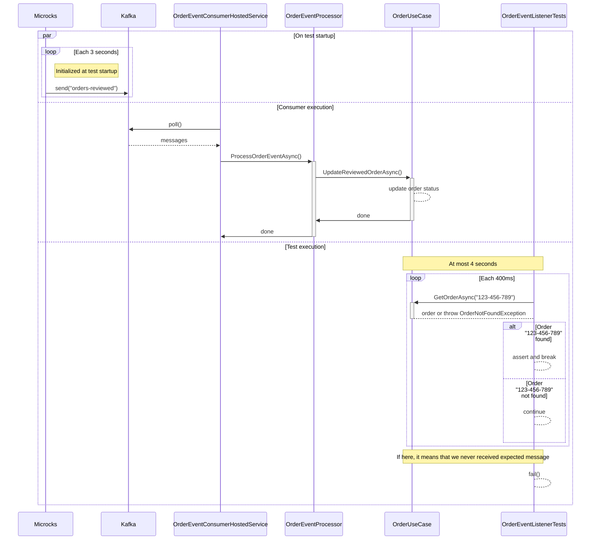

# Step 5: Let's write tests for the Async Events

Now that we address the REST/Synchronous part, let's have a look on the part related to Asynchronous Kafka events.
Testing of asynchronous or event-driven system is usually a pain for developers 🥲

## First Test - Verify our OrderService is publishing events

In this section, we'll focus on testing the `Order Service` + `Event Publisher` components of our application:


Even if it may be easy to check that the creation of an event object has been triggered with frameworks like [FakeItEasy](https://fakeiteasy.github.io/)
or others, it's far more complicated to check that this event is correctly serialized, sent to a broker and valid
regarding an Event definition...

Fortunately, Microcks and TestContainers make this thing easy!

Let's review the test class `OrderKafkaContractTests` under `tests/Order.Service.Tests/UseCases` and the well-named `TestOrderEventIsPublishedOnKafka()` 
method:

```csharp
public class OrderKafkaContractTests : BaseIntegrationTest
{
    private readonly ITestOutputHelper TestOutputHelper;

    public OrderKafkaContractTests(
        ITestOutputHelper testOutputHelper,
        MicrocksWebApplicationFactory<Program> factory)
        : base(factory)
    {
        TestOutputHelper = testOutputHelper;
    }

    [Fact]
    public async Task TestOrderEventIsPublishedOnKafka()
    {
        // Ensure topic exists
        await EnsureTopicExistsAsync("orders-created")
            .ConfigureAwait(true);

        // Prepare a Microcks test.
        var kafkaTest = new TestRequest
        {
            ServiceId = "Order Events API:0.1.0",
            FilteredOperations = new[] { "SUBSCRIBE orders-created" },
            RunnerType = TestRunnerType.ASYNC_API_SCHEMA,
            TestEndpoint = "kafka://kafka:19092/orders-created",
            Timeout = 2000L
        };

        // Prepare an application Order.
        var orderInfo = new OrderInfo
        {
            CustomerId = "123-456-789",
            ProductQuantities = new[]
            {
                new ProductQuantity("Millefeuille", 1),
                new ProductQuantity("Eclair Cafe", 1)
            },
            TotalPrice = 8.4
        };

        // Launch the Microcks test and wait a bit to be sure it actually connects to Kafka.
        var testRequestTask = MicrocksContainer.TestEndpointAsync(kafkaTest, TestContext.Current.CancellationToken);
        await Task.Delay(750, TestContext.Current.CancellationToken);

        // Invoke the application to create an order.
        var orderUseCase = Factory.Services.GetRequiredService<OrderUseCase>();
        var createdOrder = await orderUseCase.PlaceOrderAsync(
            orderInfo, TestContext.Current.CancellationToken);

        // Get the Microcks test result.
        var testResult = await testRequestTask;

        // Check success and that we read 1 valid message on the topic.
        Assert.True(testResult.Success);
        Assert.NotEmpty(testResult.TestCaseResults);
        Assert.Single(testResult.TestCaseResults[0].TestStepResults);

        var events = await MicrocksContainer.GetEventMessagesForTestCaseAsync(testResult, "SUBSCRIBE orders-created", TestContext.Current.CancellationToken);
        Assert.Single(events);
    }
}
```

Things are a bit more complex here, but we'll walk through step-by-step:
* Similarly to previous section, we prepared a Microcks-provided `TestRequest` object
  * We ask for a `AsyncAPI Schema` conformance test that will use the definition found into the `order-events-asyncapi.yaml` contract,
  * We ask Microcks to listen to the `kafka://kafka:19092/orders-created` endpoint that represents the `orders-created` topic on our Kafka broker managed by Testcontainers,
  * We ask to focus on a specific operation definition to mimic consumers that subscribe to the  `orders-created` channel,
  * We specified a timeout value that means that Microcks will only listen during 2 seconds for incoming messages. 
* We also prepared an `OrderInfo` object that will be used as the input of the `PlaceOrderAsync()` method invocation on `OrderUseCase`.
* Then, we launched the test on the Microcks side. This time, the launch is asynchronous, so we received a `Task` that will give us a `TestResult` later on
  * We wait a bit here to ensure, Microcks got some time to start the test and connect to Kafka broker.
* We can invoke our business service by creating an order with `PlaceOrderAsync()` method. We could assert whatever we want on created order as well.
* Finally, we wait for the task completion to retrieve the `TestResult` and assert on the success and check we received 1 message as a result.

The sequence diagram below details the test sequence. You'll see 2 parallel blocks being executed:
* One that corresponds to Microcks test - where it connects and listen for Kafka messages,
* One that corresponds to the `OrderUseCase` invocation that is expected to trigger a message on Kafka.



Because the test is a success, it means that Microcks has received an `OrderEvent` on the specified topic and has validated the message
conformance with the AsyncAPI contract or this event-driven architecture. So you're sure that all your .NET configuration, Kafka JSON serializer
configuration and network communication are actually correct!

### 🎁 Bonus step - Verify the event content

So you're now sure that an event has been sent to Kafka and that it's valid regarding the AsyncAPI contract. But what about the content
of this event? If you want to go further and check the content of the event, you can do it by asking Microcks the events read during the 
test execution and actually check their content. This can be done adding a few lines of code:

```csharp
[Fact]
public async Task TestOrderEventIsPublishedOnKafka()
{
    // [...] Unchanged comparing previous step.

    // Get the Microcks test result.
    var testResult = await testRequestTask;
    
    // [...] Unchanged comparing previous step.

    // Check the content of the emitted event, read from Kafka topic.
    var events = await MicrocksContainer.GetEventMessagesForTestCaseAsync(testResult, "SUBSCRIBE orders-created", TestContext.Current.CancellationToken);

    Assert.Single(events);

    var message = events[0].EventMessage;
    var messageMap = JsonSerializer.Deserialize<Dictionary<string, JsonElement>>(message.Content);

    // Properties from the event message should match the order.
    Assert.Equal("Creation", messageMap["changeReason"].GetString());
    var orderMap = JsonSerializer.Deserialize<Dictionary<string, JsonElement>>(messageMap["order"].GetRawText());
    Assert.Equal("123-456-789", orderMap["customerId"].GetString());
    Assert.Equal(8.4, orderMap["totalPrice"].GetDouble());
    Assert.Equal(2, orderMap["productQuantities"].GetArrayLength());
}
```

Here, we're using the `GetEventMessagesForTestCaseAsync()` method on the Microcks container to retrieve the messages read during the test execution.
Using the wrapped `EventMessage` class, we can then check the content of the message and assert that it matches the order we've created.

## Second Test - Verify our OrderEventConsumer is processing events

In this section, we'll focus on testing the `Event Consumer` + `Order Service` components of our application:


The final thing we want to test here is that our `OrderEventConsumerHostedService` component is actually correctly configured for connecting to Kafka,
for consuming messages, for de-serializing them into correct C# objects and for triggering the processing on the `OrderUseCase`.
That's a lot to do and can be quite complex! But things remain very simple with Microcks 😉

Let's review the test class `OrderEventListenerTests` under `tests/Order.Service.Tests/UseCases` and the well-named `TestEventIsConsumedAndProcessedByService()`
method:

```csharp
public class OrderEventListenerTests : BaseIntegrationTest
{
    private readonly ITestOutputHelper TestOutputHelper;

    public OrderEventListenerTests(
        ITestOutputHelper testOutputHelper,
        MicrocksWebApplicationFactory<Program> factory) 
        : base(factory)
    {
        TestOutputHelper = testOutputHelper;
    }
    
    [Fact]
    public async Task TestEventIsConsumedAndProcessedByService()
    {
        // Arrange
        const string expectedOrderId = "123-456-789";
        const string expectedCustomerId = "lbroudoux";
        const int expectedProductCount = 2;

        // Start the HostedService manually for the test
        using var cts = new CancellationTokenSource(TimeSpan.FromSeconds(5));
        var consumerTask = StartOrderEventConsumerAsync(cts.Token);

        OrderModel? order = null;
        // Act & Assert - Polling pattern similar to the Java example
        try
        {
            order = await PollForOrderProcessingAsync(expectedOrderId, cts);

            Assert.NotNull(order);
            // Verify the order properties match expected values
            Assert.Equal(expectedCustomerId, order.CustomerId);
            Assert.Equal(OrderStatus.Validated, order.Status);
            Assert.Equal(expectedProductCount, order.ProductQuantities.Count);
        }
        catch (TimeoutException)
        {
            Assert.Fail("The expected Order was not received/processed in expected delay");
        }
        finally
        {
            // Stop the consumer
            cts.Cancel();
            await consumerTask;
        }
    }

    private async Task<OrderModel> PollForOrderProcessingAsync(
        string expectedOrderId,
        CancellationTokenSource cts)
    {
        var pollDelay = TimeSpan.FromMilliseconds(400);
        var pollInterval = TimeSpan.FromMilliseconds(400);
        var startTime = DateTime.UtcNow;

        var orderUseCase = Factory.Services.GetRequiredService<OrderUseCase>();
        // Initial delay
        await Task.Delay(pollDelay, TestContext.Current.CancellationToken);

        while (DateTime.UtcNow - startTime < TimeSpan.FromSeconds(4))
        {
            try
            {
                var order = await orderUseCase.GetOrderAsync(expectedOrderId, TestContext.Current.CancellationToken);
                
                if (order is not null)
                {
                    TestOutputHelper.WriteLine($"Order {order.Id} successfully processed!");
                    cts.Cancel(); // Cancel the consumer after successful processing
                    return order;
                }
            }
            catch (OrderNotFoundException)
            {
                // Continue polling until timeout
                TestOutputHelper.WriteLine($"Order {expectedOrderId} not found yet, continuing to poll...");
            }

            await Task.Delay(pollInterval, TestContext.Current.CancellationToken);
        }

        throw new TimeoutException($"Order {expectedOrderId} was not processed within the expected timeout.");
    }

    private async Task StartOrderEventConsumerAsync(CancellationToken cancellationToken)
    {
        // Create the OrderEventConsumer manually
        var logger = Factory.Services.GetRequiredService<ILogger<OrderEventConsumerHostedService>>();
        var orderEventConsumer = new OrderEventConsumerHostedService(logger, Factory.Services);

        TestOutputHelper.WriteLine("Starting OrderEventConsumer for test");
        
        try
        {
            await orderEventConsumer.StartAsync(cancellationToken);
            
            // Keep it running until cancelled
            var tcs = new TaskCompletionSource<bool>();
            using var registration = cancellationToken.Register(() => tcs.SetResult(true));
            await tcs.Task;
        }
        finally
        {
            await orderEventConsumer.StopAsync(CancellationToken.None);
            orderEventConsumer.Dispose();
            TestOutputHelper.WriteLine("OrderEventConsumer stopped");
        }
    }
}
```

To fully understand this test, remember that as soon as you're launching the test, we start Kafka and Microcks containers and that Microcks
is immediately starting publishing mock messages on this broker. So this test actually starts the `OrderEventConsumerHostedService` manually and then uses a waiting loop, just checking that the
messages produced by Microcks are correctly received and processed on the application side.

The important things to get in this test are:
* We start the `OrderEventConsumerHostedService` manually for the test duration to consume messages from the `orders-reviewed` topic,
* We're waiting at most 4 seconds here because the default publication frequency of Microcks mocks is 3 seconds (this can be configured as you want of course),
* Within each polling iteration, we're checking for the order with id `123-456-789` because these are the values defined within the `order-events-asyncapi.yaml` AsyncAPI contract examples
* If we retrieve this order and get the correct information from the service, it means that is has been received and correctly processed!
* If no message is found before the end of 4 seconds, the loop exits with a `TimeoutException` and we mark our test as failed.

The sequence diagram below details the test sequence. You'll see 3 parallel blocks being executed:
* The first corresponds to Microcks mocks - where it connects to Kafka, creates a topic and publishes sample messages each 3 seconds,
* The second one corresponds to the `OrderEventListener` invocation that should be triggered when a message is found in the topic,
* The third one corresponds to the actual test - where we check that the specified order has been found and processed by the `OrderService`. 



You did it and succeed in writing integration tests for all your application component with minimum boilerplate code! 🤩 


### Why we manually start the consumer instead of relying on IHostedService

In a typical .NET application, the `OrderEventConsumerHostedService` would be automatically started by the dependency injection container as part of the application startup. However, in integration tests, we manually start and stop the consumer to gain precise control over the test execution.

**Manual Control Benefits:**
1. **Test Isolation**: Each test has full control over when the consumer starts and stops
2. **Timing Control**: We can synchronize test execution with the consumer lifecycle
3. **Explicit Resource Management**: Clear cleanup and disposal in test scenarios
4. **Debugging Clarity**: Easier to understand failures and timing issues

**Why this approach works well here:**
- Microcks publishes messages immediately on startup, so we need precise timing control
- We want to stop consuming as soon as we get the expected message (within 4 seconds max)
- It provides better test reliability and reduces flakiness

This is why we use the `StartOrderEventConsumerAsync()` method in our test.


## Wrap-up

Thanks a lot for being through this quite long demonstration. We hope you learned new techniques for integration tests with both REST and Async/Event-driven APIs. Cheers! 🍻